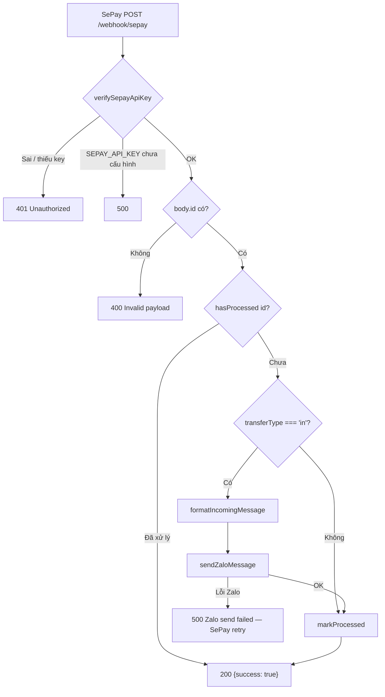

# Kiến trúc & Plan triển khai — SePay → Zalo Bot

Tài liệu tổng hợp kiến trúc hệ thống và các bước triển khai, khớp với code hiện tại trong repository `sepay-zalo-bot`.

---

## 1. Tổng quan hệ thống

Hệ thống nhận webhook giao dịch từ **SePay**, xử lý tại backend **Node.js (Express)**, rồi gửi thông báo tiền vào vào group Zalo qua **Zalo Bot API** (`sendMessage`).

```
SePay (ngân hàng đã liên kết)
        │  POST /webhook/sepay
        │  Authorization: Apikey <SEPAY_API_KEY>
        ▼
Backend Node.js (Express)
        │  auth → dedup → filter transferType=in → format
        ▼
Zalo Bot API  →  group chat_id = zgr-d0a1a6afd9c0309e69d1
```

**Mục tiêu:** mỗi khi có tiền vào tài khoản SePay, group Zalo nhận tin nhắn markdown (ngân hàng, số tiền, thời gian, nội dung, mã GD, STK…).

**Yêu cầu vận hành:**

- Node.js 18+
- Zalo Bot Token (tạo qua OA / [Zalo Bot Manager](https://docs.zaloplatforms.com/docs/BOT))
- Bot đã được mời vào group `zgr-d0a1a6afd9c0309e69d1`
- Tài khoản SePay đã liên kết ngân hàng

---

## 2. Kiến trúc

### 2.1. Cấu trúc thư mục

```
sepay-zalo-bot/
├── ARCHITECTURE.md          # Tài liệu này
├── README.md                # Hướng dẫn nhanh
├── package.json             # ESM, scripts start/dev
├── .env.example             # Mẫu biến môi trường
├── .env                     # Cấu hình thực tế (không commit)
├── data/
│   └── processed.json       # Danh sách id giao dịch đã xử lý (dedup)
└── src/
    ├── index.js             # Express app, endpoint webhook & health
    ├── sepayAuth.js         # Xác thực Api_Key từ header Authorization
    ├── dedup.js             # Chống trùng theo id → data/processed.json
    ├── formatMessage.js     # Format tin nhắn markdown tiền vào
    └── zalo.js              # Gọi Zalo Bot API sendMessage
```

### 2.2. Vai trò từng module

| File | Vai trò |
| --- | --- |
| `src/index.js` | Khởi tạo Express, `GET /health`, `POST /webhook/sepay`, orchestration luồng |
| `src/sepayAuth.js` | Đọc `Authorization: Apikey …`, so khớp `SEPAY_API_KEY` |
| `src/dedup.js` | Lưu/đọc id đã xử lý tại `data/processed.json` |
| `src/formatMessage.js` | Tạo nội dung tin (gateway, amount, date, content, code, referenceCode, accountNumber) |
| `src/zalo.js` | `POST https://bot-api.zaloplatforms.com/bot{token}/sendMessage` |

### 2.3. Luồng xử lý webhook



Thứ tự trong code (`src/index.js`):

1. Xác thực API Key (`verifySepayApiKey`)
2. Kiểm tra payload có `id`
3. Dedup theo `id` — nếu đã có trong `data/processed.json` → trả `{"success": true}` ngay (không gửi lại Zalo)
4. Chỉ gọi Zalo khi `transferType === "in"`
5. Zalo fail → **HTTP 500** (không `markProcessed`) để SePay retry
6. Thành công (hoặc giao dịch không phải `in`) → `markProcessed` rồi `{"success": true}`

### 2.4. Endpoint

| Method | Path | Mô tả | Response điển hình |
| --- | --- | --- | --- |
| `GET` | `/health` | Health check | `{"ok": true}` |
| `POST` | `/webhook/sepay` | Nhận webhook SePay | `{"success": true}` (200) khi OK |

Body JSON (giới hạn `1mb`) — các field chính dùng trong format tin:

- `id` (bắt buộc để xử lý)
- `transferType` — chỉ `"in"` mới gửi Zalo
- `gateway`, `transferAmount`, `transactionDate`, `content`
- `code`, `referenceCode`, `accountNumber` (tùy chọn)

### 2.5. Auth Api_Key

- Biến môi trường: `SEPAY_API_KEY`
- SePay gửi header: `Authorization: Apikey <SEPAY_API_KEY>`
- Logic: `src/sepayAuth.js` — regex `/^Apikey\s+(.+)$/i`, so khớp chuỗi exact
- Sai/thiếu → `401` `{ success: false, message: "Unauthorized" }`
- Chưa cấu hình `SEPAY_API_KEY` → `500`

### 2.6. Dedup file

- File: `data/processed.json` (mảng các `id` dạng string)
- Module: `src/dedup.js` — tự tạo thư mục `data/` và file nếu chưa có
- `hasProcessed(id)` / `markProcessed(id)`
- Mục đích: tránh gửi trùng khi SePay retry hoặc gửi lại cùng `id`

### 2.7. Filter `transferType=in`

- Chỉ khi `data.transferType === "in"` mới format + `sendZaloMessage`
- Giao dịch khác (ví dụ tiền ra) vẫn được `markProcessed` và trả `success: true` mà không gửi Zalo
- Trên dashboard SePay nên chọn loại **Tiền vào (`In_only`)** để giảm payload không cần thiết

### 2.8. Gửi Zalo

- Token: `ZALO_BOT_TOKEN`
- Chat: `ZALO_CHAT_ID` (mặc định group `zgr-d0a1a6afd9c0309e69d1`)
- API: `POST https://bot-api.zaloplatforms.com/bot{token}/sendMessage`
- Body: `{ chat_id, text, parse_mode: "markdown" }`

---

## 3. Biến môi trường

Theo `.env.example`:

| Biến | Bắt buộc | Mô tả |
| --- | --- | --- |
| `PORT` | Không | Port HTTP, mặc định `3000` |
| `ZALO_BOT_TOKEN` | Có | Token bot từ Zalo Bot Manager |
| `ZALO_CHAT_ID` | Có | ID group đích, ví dụ `zgr-d0a1a6afd9c0309e69d1` |
| `SEPAY_API_KEY` | Có | Key tự tạo; cùng giá trị trên dashboard SePay |

Sao chép mẫu:

```bash
cp .env.example .env
```

---

## 4. Plan triển khai từng bước

### Bước 1 — Cài đặt

```bash
npm install
```

Yêu cầu: Node.js `>=18` (`package.json` → `engines`).

### Bước 2 — Cấu hình `.env`

```bash
cp .env.example .env
```

Điền:

```
PORT=3000
ZALO_BOT_TOKEN=<token từ Zalo Bot Manager>
ZALO_CHAT_ID=zgr-d0a1a6afd9c0309e69d1
SEPAY_API_KEY=<key tự tạo, dùng cùng giá trị trên dashboard SePay>
```

### Bước 3 — Chạy server

```bash
npm start
# hoặc hot-reload khi dev:
npm run dev
```

Kiểm tra: `GET http://localhost:3000/health` → `{"ok": true}`.

### Bước 4 — Cấu hình SePay dashboard

Dashboard SePay → **Webhooks** → **Thêm webhook**:

| Trường | Giá trị |
| --- | --- |
| URL | `https://<domain-của-bạn>/webhook/sepay` |
| Loại giao dịch | Tiền vào (`In_only`) |
| Xác thực | **Api_Key** |
| Content-Type | JSON |
| API Key | Cùng giá trị với `SEPAY_API_KEY` trong `.env` |

Endpoint phải trả `{"success": true}` (HTTP 200) khi nhận thành công.

### Bước 5 — Test local với ngrok

```bash
npm start
# terminal khác
ngrok http 3000
```

Dán URL dạng `https://xxxx.ngrok-free.app/webhook/sepay` vào dashboard SePay, rồi dùng **Gửi thử** hoặc chuyển khoản nhỏ để kiểm tra.

### Bước 6 — Checklist bot trong group

1. Tạo bot trên Zalo Bot Manager, lấy `ZALO_BOT_TOKEN`.
2. Mời bot vào group đích (`zgr-d0a1a6afd9c0309e69d1`).
3. Điền token + chat id vào `.env`.
4. Gọi thử webhook — tin nhắn phải hiện trong group.

Nếu bot chưa ở trong group, `sendMessage` sẽ fail và endpoint trả `500` để SePay retry.

---

## 5. Ghi chú lỗi / retry

| Tình huống | HTTP | Ghi chú |
| --- | --- | --- |
| Sai / thiếu Api_Key | 401 | Không retry hữu ích cho đến khi sửa key |
| Thiếu `id` trong body | 400 | Payload không hợp lệ |
| Id đã xử lý | 200 `success: true` | Idempotent — không gửi Zalo lần nữa |
| **Zalo `sendMessage` fail** | **500** | **Không** `markProcessed` → SePay có thể **retry**; khi Zalo OK sẽ gửi và đánh dấu |
| Lỗi nội bộ khác | 500 | Log `[webhook]`; SePay có thể retry |

**Điểm quan trọng:** Zalo fail → `500` với `{ success: false, message: "Zalo send failed" }`. Vì chưa gọi `markProcessed`, lần retry sau vẫn có thể gửi tin khi Zalo/group ổn định trở lại.

**Lưu ý vận hành:**

- Đảm bảo bot đã trong group trước khi bật webhook production.
- File `data/processed.json` cần được giữ nguyên giữa các lần restart (volume/persistent disk nếu deploy container).
- Không commit `.env` chứa secret thật.
